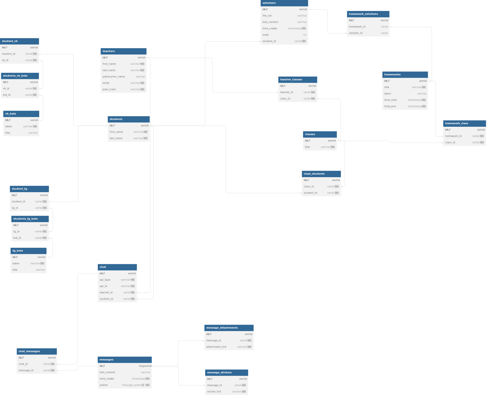

# v1
> 18.10.2023

## SQL
- [Init database](./sql/init.sql)

## Shema

## Problems
1. Как реализовать чаты? 
   - У учителя может быть несколько чатов с одним учеником (напр. ВК и ТГ через ботов)
   - id студента в нашей базе и id в внешних мессенджерах разные, как сохранить связь с унифицированным сообщением (таблица messages) с учиттелем и учеником

